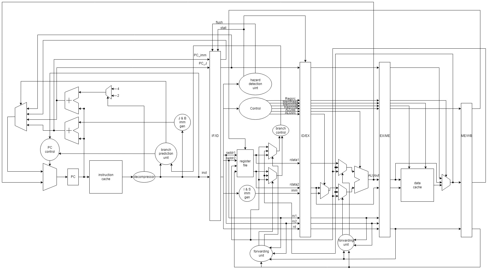

# RISCV_Processor
## 5-stage pipelined RISCV processor
> please check out Report.pdf for more info
* 5-stage piplined
* hazard detection unit
* forwarding units
* branch prediction unit
* decompressor for compressed RISCV instructions
* read-only cache for Instructions
* 2-way associative cache for Memory
* Support various instrcutions including compressed ones
## RISCV structure

## Run
You can test different functions through different commands:
> ### vcs Final_tb.v CHIP.v slow_memory.v -full64 -R -debug_access+all +v2k +define+noHazard
> ### “noHazard” can be changed to “hasHazard”, “BrPred”, “compression” or “decompression”, see Final_tb.v for more details
